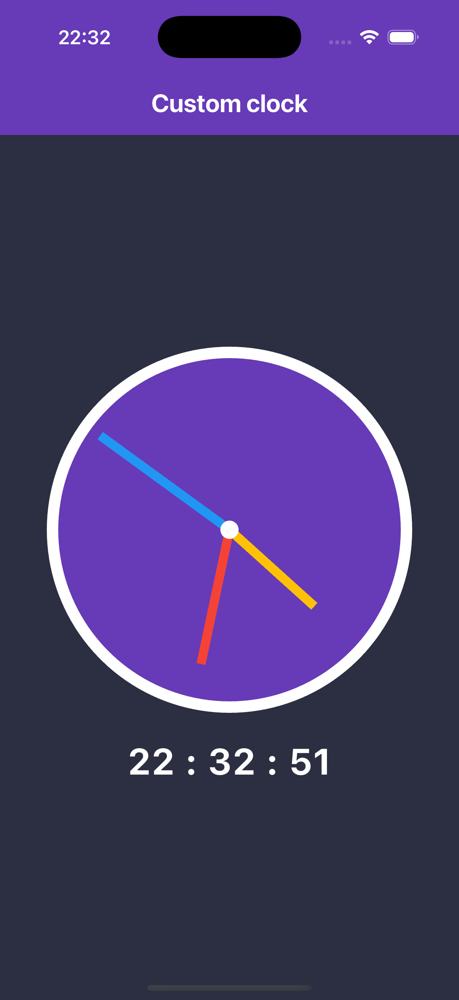

# 🕒 Flutter Clock App

A clean and minimal Flutter clock app built **only** using `setState` and `CustomPaint`.  
This project demonstrates how to create an analog + digital clock without using any external state management libraries.

## ✨ Features

- ⏱️ Real-time clock updates every second
- 🎨 Custom clock face using `CustomPainter`
- 🧠 No external state management – only `setState`
- 🌙 Dark-themed interface

## 📸 Screenshots



## 📦 Built With

- [Flutter](https://flutter.dev)
- `setState` – for state management
- `CustomPaint` – for drawing the clock face and hands

## 🚀 Getting Started

To run this project locally:

```bash
git clone https://github.com/narzu11ayevnodirbek/clock_task.git
cd clock_task
flutter pub get
flutter run
